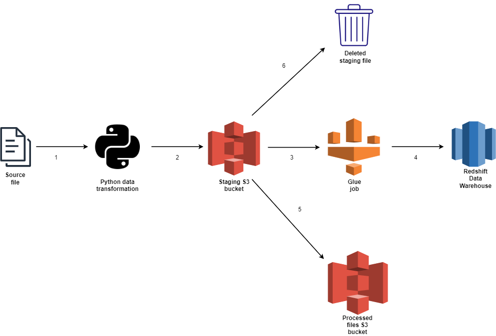
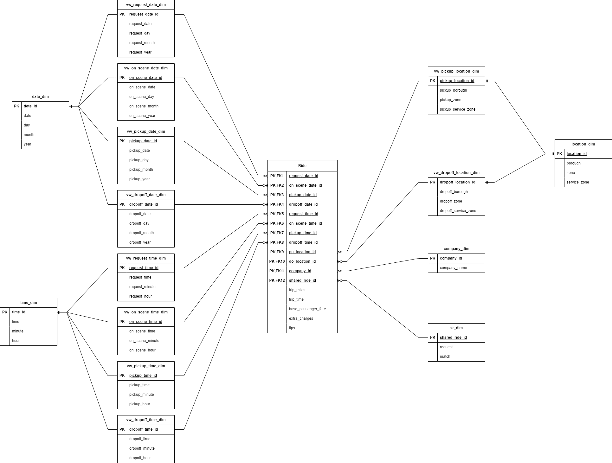

# NYC High Volume For Hire Vehicle ETL & Data warehouse project
This a data warehousing & ETL project developed using Python AWS SDK & PGSQL. The ETL process retrieves downloaded data from NYC TLC website, transforms the dataset and loads it into a Redshift datawarehouse.

## Project workflow
1.	Data ingestion from first staging area
Ingest monthly dataset from my local directory(first staging area):

2.	Data transformation
Python scripts that changes data types, rename fields, drop fields and add business logic on certain columns.

3.	First data load to second staging area  
Transformed data is transferred to an S3 bucket (second staging area) using AWS SDK Boto3

4.	Second data load
Once first load is complete, an AWS Glue job is started and the dataset is loaded into a Redshift data warehouse

5.	Dataset S3 copy
Dataset in S3 bucket (second staging area) is copied to the processed S3 bucket

6.	Dataset S3 delete
Dataset in S3 bucket (second staging area) is deleted to prevent duplicate load

## Project configuration
Environment variables:

These are either sensitive variables or variables I don’t want being changed now or in the future:
* region_name = region name for aws resources 
* access_key_id = aws key id credential
* secret_access_key = aws access key credential
* processed_before_bucket_name = S3 staging area bucket name
* processed_after_bucket_name = S3 processed bucket name
* processed_before_bucket_path = S3 staging area bucket path
* processed_after_bucket_path = S3 processed bucket path
* staging_directory = staging folder in local directory

AWS cinfigurations:
* AWS account
* Access keys

Redshift configuration:
* Redshift cluster setup
* CREATE statements for tables and views 

S3 configuration:
* Create bucket to stage tranformed dataset
* Create bucket to hold data once load to Redshift is complete

## Data warehouse multi-dimensional data model:

